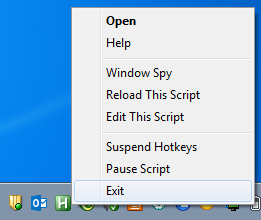

As I use Linux on a daily basis, project is passively looking for a new maintainer. Feel free to open an issue, if you see fit.

# win-onlyonekeyboardlayout
Force Microsoft Windows to use only one keyboard layout every 5 seconds.
 This is code from an unknown AHK forums post, what used caps lock to toggle between russian and english keyboard layout. I bodged it to fit my needs.

## Prerequisites
 - Have [AutoHotkey](https://www.autohotkey.com/) installed.

## Usage
1. Download [OnlyESTkeyboardlayout.ahk](OnlyESTkeyboardlayout.ahk)
2. Find your language from [here](https://docs.microsoft.com/en-us/windows-hardware/manufacture/desktop/default-input-locales-for-windows-language-packs)

3. Edit the file you have downloaded and replace 3 occurances of `et` (on lines 2, 11, 15) (with your own (for example `fi`) and 

replace the number after Str with the one you have (for example with `0000040b`
4. Save and close the file.
5. Move the script to your startup folder (access with pressing `WIN`+`R` and typing in `shell:startup`)
6. Done! Next time your computer starts the script will run. Optionally you can run it now.

## Notes
 - To temporarily stop the script from changing your keyboard layout, right click the green H icon in your taskbar and press `pause script`. To start it again press it again.
 
 
